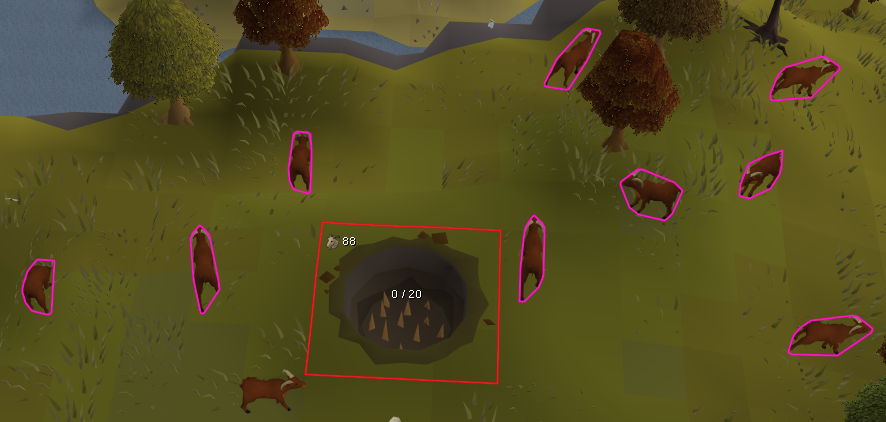

<h1 align="center">Goat Pit Indicators</h1>

  

Goat Pit Indicators is a RuneLite plugin that shows how full a goat pit is at a glance, and reminds you when an emptied pit still needs its spikes put back. The plugin draws the pit's state directly on the pit itself: a colored fill and an `X / N` count you can read from across the area, so you never have to walk over and count by hand. The capacity `N` is not fixed — it grows with your Hunter level, from 16 at level 60 up to 24 at level 93+.

## Features

- **See how full a pit is without walking to it**

  While the goat pit is in view it carries a live `X / N` count and a color fill that reads at a glance — green when the pit is full, a neutral fill while it is filling up. The capacity `N` tracks your Hunter level (16 at 60, rising to 24 at 93+).

- **Never forget the spikes**

  When a pit is empty and its spikes have not been re-added, the fill turns red and an "Add Spikes" prompt appears on the pit. An empty pit that still has its spikes is left neutral, so the warning only shows when it actually matters.

- **Grab the ones you can reach**

  Goats you can lure into a spiked, non-full pit from where you stand glow with an outline, so you can top a pit up without walking over. Only shows when you can actually cast the spell (Telekinetic Grab or Dark Lure) and the pit has room. When several are in range, the outline fades from a near color on the closest goat to a far color on the furthest, so you know which to grab first.

- **Prod the ones already close**

  With a Cattleprod equipped, the outline switches to the goats you can prod into a spiked, non-full pit — those within prod range — drawn in their own color and the same near/far gradient. Optionally limited to the goats you can prod in from exactly where you stand, judged from the tile a click would walk you to, so you are never shown a goat you would have to reposition for first.

- **Know where to stand**

  An optional best-tile marker shows the tile you can walk to that puts the most goats in reach at once — across the pit and in range for a lure spell, or right beside you for a Cattleprod — with a "Stand here" count. It updates every tick as the goats wander.

- **Find the spike supply when a pit runs dry**

  When a pit needs re-spiking and you are carrying none, the spike supply object is outlined in the same warning colors, with a "Take Spike" prompt — so you can restock without hunting for it.

- **Track your lifetime total**

  A running count of every goat you have caught, drawn on the pit and kept across logins and client restarts. The game keeps no total of its own, so the plugin tallies each catch itself. The total's icon is an animated leaping goat by default. Place it on any compass point, or turn it off.

- **See how the session is going**

  An optional movable infobox tracks this session at a glance: time elapsed, goats caught, goats per hour, and Hunter XP gained and per hour. Starts when the plugin loads, resets on demand, and drags anywhere you like.

- **Watch the ones on their way in**

  A live count of your goats currently in transit to the pit — lured or prodded — so a busy pit's true fill is clear before the goats land.

- **Get pinged when the pit fills**

  Filling a pit is semi-AFK, and the moment that matters is when it reaches capacity and needs emptying. The plugin fires a notification once the pit is full — tray, sound, and screen flash all follow your notification settings — and re-arms after you empty it, so one fill is one ping. Optionally count goats still in transit toward the trigger to be pinged the moment the pit is committed to filling.

- **Guard against misclicks**

  Optional right-click reordering keeps stray left-clicks from wasting a cast or clearing a pit early: "Cancel" jumps up when the pit is effectively full, "Walk here" leads while a Cattleprod is equipped, "Clear Goat Pit" drops off the top until the pit is actually full, and a goat's own cast stays on top when another NPC — like Geoff — stands on its tile, so the overlap can't steal your telegrab.

- **Make it yours**

  The outline gradient, the reminder fills, the telegrab and prod colors, the label colors and formats, the menu reordering, and the draw distance are all configurable, grouped into sections. Turn the whole overlay off from the config panel when you don't need it.

## Screenshots

| Filling up | Full |
|---|---|
|  |  |
| **Empty, still spiked** | **Needs spikes** |
|  |  |

Goats you can lure into the pit glow pink:

## Configuration

**Indicators**

| Setting | What it does | Default |
|---|---|---|
| Show Color Indicators | Master toggle for the on-pit outline and fills | On |
| Show "Add Spikes" | Show the spikes reminder on an empty, unspiked pit | On |
| Highlight Telegrabbable | Outline goats you can lure into a spiked, non-full pit, when you can cast Telekinetic Grab or Dark Lure | On |
| Highlight Prodable | While a Cattleprod is equipped, outline goats you can prod into a spiked, non-full pit instead (takes over the telegrab outline) | On |
| Prodable from Location | Only highlight prodable goats you can prod in without repositioning, judged from the tile a click would walk you to | On |
| Near/Far Gradient | Shade each highlighted goat's outline by distance to the pit, closest color to furthest; applies to both the telegrab and prod highlights | On |
| Highlight Spike Supply | Outline the spike supply when a pit needs lining and you carry no spikes | On |
| Highlight Best Tile | Mark the reachable tile that puts the most goats in reach at once — lure range and across the pit, or beside you to prod — with a "Stand here" count | Off |

**Indicator Colors**

| Setting | What it does | Default |
|---|---|---|
| Empty Outline | Outline for an empty/unspiked pit; low end of the fill gradient (RGB) | Red |
| Midpoint Outline | Middle of the outline gradient (RGB) | Gold |
| Full Outline | Outline for a full pit; high end of the gradient (RGB) | Green |
| Spike Reminder Fill | Fill for a pit that needs spikes (alpha 0 = outline only) | Faint red |
| Full Reminder Fill | Fill for a full pit ready to empty (alpha 0 = outline only) | Faint green |
| Telegrab Closest | Outline for the closest (highest-priority) lure target | Pink |
| Telegrab Furthest | Outline for the furthest (lowest-priority) lure target | Faint pink |
| Prod Closest | Outline for the closest prodable goat, nearest the pit | Orange |
| Prod Furthest | Outline for the furthest prodable goat still in prod range | Pale yellow |
| Best Tile | Color of the best-tile marker and its "Stand here" label | Cyan |

**Labels**

| Setting | What it does | Default |
|---|---|---|
| Show Goats in Pit | Show the `X / N` count label (capacity scales with Hunter level) | On |
| Pit Indicator Style | Draw the count as text, a progress bar, or both | Text |
| Show Goats in Transit | Where to draw a running count of goats on their way in: Off, Center, or a compass point | Center |
| In Transit Prefix | What precedes the in-transit number: nothing, a label, or the icon | Icon |
| Show Total Caught | Where to draw the lifetime catch total: Off or a compass point | South-East |
| Total Prefix | What precedes the total: nothing, a "Total: " label, or the animated goat | Animated |
| Count Label Color | Color of the count and "Add Spikes" text | White |
| Total Label Color | Color of the total-caught text | White |

**Context Menu**

| Setting | What it does | Default |
|---|---|---|
| "Cancel" First When Full | Raise "Cancel" when you cast a lure on a goat but the pit is effectively full | On |
| "Walk here" First With Prod | Raise "Walk here" while a Cattleprod is equipped and the pit is effectively full | On |
| "Clear" Last While Spikes Sharp | Demote "Clear Goat Pit" off the top of the menu while a pit can still catch — spiked and not yet full | On |
| Goat First For Telegrab | Keep a goat's cast on top when another NPC (like Geoff) shares its tile, so the overlap can't steal the click | On |

**Notifications**

| Setting | What it does | Default |
|---|---|---|
| Notify When Pit Is Full | Fire a notification (tray / sound / flash) once the pit fills and needs emptying, re-arming after you empty it | On |
| Count Goats In Transit | Count goats still on their way in toward the full trigger, firing the moment the pit is committed to filling | On |

**Misc**

| Setting | What it does | Default |
|---|---|---|
| Goat Total Format | Lifetime total written short (1K) or full (1,024) | Short |
| Draw Distance | How far away the pit still draws (tiles) | 32 |

**Session**

| Setting | What it does | Default |
|---|---|---|
| Show Session Stats | Show a movable infobox with this session's time, goats caught, goats/hr, and Hunter XP gained and per hour | On |
| Reset Session Stats | Tick to restart the session (time, catches, XP); un-ticks itself | Off |

## Links

- [Report a bug](https://github.com/Oveduumnakal/Goat-Pit-Indicators-Plugin/issues/new?template=bug_report.yml)
- [Request a feature](https://github.com/Oveduumnakal/Goat-Pit-Indicators-Plugin/issues/new?template=feature_request.yml)
- [Buy me a coffee](https://buymeacoffee.com/oveduumnakal)
