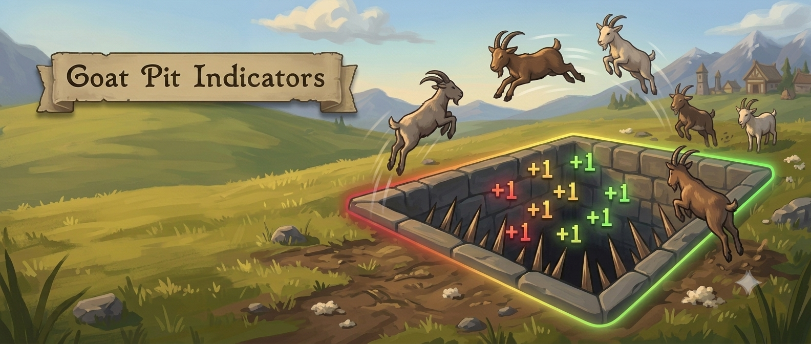
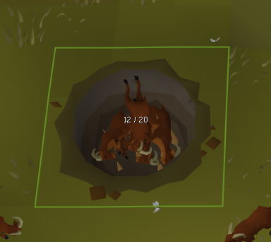
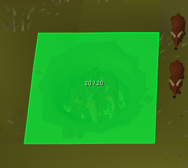
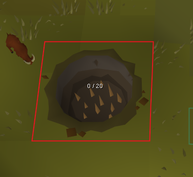
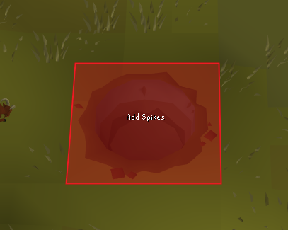

<h1 align="center">Goat Pit Indicators</h1>

  

Goat Pit Indicators is a RuneLite plugin that shows how full a goat pit is at a glance, and reminds you when an emptied pit still needs its spikes put back. The plugin draws the pit's state directly on the pit itself: a colored fill and an `X / N` count you can read from across the area, so you never have to walk over and count by hand. The capacity `N` is not fixed — it grows with your Hunter level, from 16 at level 60 up to 24 at level 93+.

## Features

- **See how full a pit is without walking to it**

  Every goat pit in view carries a live `X / N` count and a color fill that reads at a glance — green when the pit is full, a neutral fill while it is filling up. The capacity `N` tracks your Hunter level (16 at 60, rising to 24 at 93+).

- **Never forget the spikes**

  When a pit is empty and its spikes have not been re-added, the fill turns red and an "Add Spikes" prompt appears on the pit. An empty pit that still has its spikes is left neutral, so the warning only shows when it actually matters.

- **Make it yours**

  The outline gradient, the reminder fills, the telegrab highlight, the label colors, and the draw distance are all configurable, grouped into sections. Turn the whole overlay off from the config panel when you don't need it.

## Screenshots

| Filling up | Full |
|---|---|
|  |  |
| **Empty, still spiked** | **Needs spikes** |
|  |  |

## Configuration

**Indicators**

| Setting | What it does | Default |
|---|---|---|
| Show Color Indicators | Master toggle for the on-pit outline and fills | On |
| Show "Add Spikes" | Show the spikes reminder on an empty, unspiked pit | On |
| Highlight Telegrabbable | Glow goats you can telegrab into a spiked, non-full pit | On |

**Indicator Colors**

| Setting | What it does | Default |
|---|---|---|
| Empty Outline | Outline for an empty/unspiked pit; low end of the fill gradient (RGB) | Red |
| Midpoint Outline | Middle of the outline gradient (RGB) | Gold |
| Full Outline | Outline for a full pit; high end of the gradient (RGB) | Green |
| Spike Reminder Fill | Fill for a pit that needs spikes (alpha 0 = outline only) | Faint red |
| Full Reminder Fill | Fill for a full pit ready to empty (alpha 0 = outline only) | Faint green |
| Telegrab Color | Outline for telegrabbable goats | Pink |

**Labels**

| Setting | What it does | Default |
|---|---|---|
| Show Goats in Pit | Show the `X / N` count label (capacity scales with Hunter level) | On |
| Show Total Caught | Where to draw the lifetime catch total: Off or a compass point | South-East |
| Count Label Color | Color of the count and "Add Spikes" text | White |
| Total Label Color | Color of the total-caught text | White |

**Misc**

| Setting | What it does | Default |
|---|---|---|
| Draw Distance | How far away pits still draw (tiles) | 32 |

## Links

- [Report a bug](https://github.com/Oveduumnakal/Goat-Pit-Indicators-Plugin/issues/new?template=bug_report.yml)
- [Request a feature](https://github.com/Oveduumnakal/Goat-Pit-Indicators-Plugin/issues/new?template=feature_request.yml)
- [Buy me a coffee](https://buymeacoffee.com/oveduumnakal)
